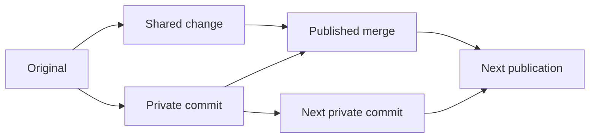

# Development workflow analysis

**The working prototype is delivered; broader qualification is deferred.**
[Build and use it](PROTOTYPE.md), including package deletion and the shared
UUI/terminal conflict workflow. The private-clone recommendation is withdrawn.
That approach copies entire packages and leaves their untouched files stale
until explicit synchronization. It does not solve the requested workflow,
regardless of its successful native-tool and publication tests.

The required outcomes are good conflict resolution, continued shared updates
during development, durable private work, native access to the full packages
tree, and low storage/I/O cost for small edits. The user is open to better
mechanisms than their suggested implementation. Changing one label must not
clone a package containing gigabytes of images or freeze its unrelated files.
Automatic whole-package cloning on first write would retain those defects and
would itself need filesystem interception; it was not implemented or tested.

Full filesystem and production qualification remain open. The user prioritized
the working prototype over further optimization and broader qualification.
Installed instances retain their previous filesystem behavior. The
[implementation checklist](../WORKFLOW_IMPLEMENTATION.md) tracks unfinished
integration gates.

The user accepts the measured sparse-Gofer read overhead for the prototype.
Prioritize correct writes and the edit/activate/Git-conflict/resolve/retry loop;
additional read-performance tuning is not the next gate.

Symlinks are not a package requirement; the current source repositories contain
no tracked links. Ordinary link deletion/rename and Git side selection pass the
native activation fixture. The extended standalone namespace check exposes a
remaining open-symlink-after-unlink failure. That compatibility case is deferred
and does not delay the prototype's activation/editor delivery.

## What the comparison establishes

Native files and Git already own durability, executable loading, mmap, directory
operations, private branches, original versions, and conflict resolution. A live
copy-on-write view needs another filesystem implementation to own mutation
ordering, originals, namespace recovery, open writable generations, and coherent
external changes. Neither a watcher nor an activation-only patch can supply that
contract safely.

The current first-party package HEADs contain 727 tracked files and 32.4 MB of
content across 12 packages, mostly a 26.4 MB demo package. This excludes Git
history, untracked data, and allocation overhead. The 10,000-file experiments
deliberately exercise a larger file-count case. Actual deployment storage and
larger histories still need measurement; private checkouts are not storage
proportional only to edits.

## Phase 2 findings

| Candidate                                  | Observed result                                                                                                                                                                                                                        | Decision                                                                                           |
| ------------------------------------------ | -------------------------------------------------------------------------------------------------------------------------------------------------------------------------------------------------------------------------------------- | -------------------------------------------------------------------------------------------------- |
| Current gVisor private overlay             | Stale sizes, replacement inodes, deleted names, renamed directories, and negative lookups; private source disappears after abrupt runtime recreation.                                                                                  | Reject as a durable live workspace.                                                                |
| Corrected stock-runsc configuration        | All ten shared-file checks and path/stream hashing pass while private writes remain isolated and system/home storage survives. Private source still disappears on runtime loss, and shared Git HEAD changes disturb the private index. | Useful root-cause evidence; not a complete replacement.                                            |
| Stock overlay with durable gofer upper     | A label edit copies no assets and private files survive runtime recreation. An open lower descriptor makes new path reads stale; Git index replacement panics when native whiteout creation returns EPERM.                             | Reject the tested configuration; disabling directfs has the same failures.                         |
| Durable independent Git repositories       | Native filesystem checks, branch/commit persistence, later-write preservation, real conflict resolution/retry, retained PTY continuity, and transfer to another sandbox pass.                                                          | Reject for workspace adoption: package-size copies and stale untouched files.                      |
| Linux OverlayFS over a changing lower tree | Linux declares changing a mounted underlying layer undefined.                                                                                                                                                                          | Reject for the immediate live-view requirement.                                                    |
| External FUSE inside pinned gVisor         | Earlier actual Git index mmap and ELF execution fail; the minimal 10k-file prototype also scans much more slowly.                                                                                                                      | Reject this runtime path for general development.                                                  |
| Host FUSE through the ordinary gofer       | Host FUSE device open again returns EPERM. A suitable live filesystem is not implemented or qualified.                                                                                                                                 | Possible further research for the unchanged requirement; no performance claim.                     |
| Custom gofer extension                     | Upstream SDK probe preserves live reads, mmap/ELF, and completed writes without asset copies. Atomic saves, private links, local inotify, and mounted native Git text conflicts/resolution now pass.                                   | Continue qualification; full namespace, crash recovery, Git ownership, and activation remain open. |

The Linux limitation is an upstream contract, not inferred from an ordinary read
smoke.
[OverlayFS documentation](https://docs.kernel.org/filesystems/overlayfs.html#changes-to-underlying-filesystems).
Pinned-era gVisor's FUSE `ConfigureMMap` returns `ENOSYS`; implementing more
FUSE server operations does not repair that client limitation.
[Filesystem source](https://github.com/google/gvisor/blob/release-20260817.0/pkg/sentry/fsimpl/fuse/regular_file.go),
[custom gofer interface](https://gvisor.dev/docs/user_guide/filesystem/#custom-gofer-extensions).

The mount defect belongs to `developmentSpec`: its
`dev.gvisor.spec.mount.packages.share=container` hint selects exclusive lower
access even with `--file-access-mounts=shared`. The lower tree is actually
shared. Simply changing the hint would remove isolation with the current overlay
flags.
[Pinned mount hints](https://github.com/google/gvisor/blob/release-20260817.0/runsc/boot/mount_hints.go).

The disposable correction uses package `share=shared`, `--overlay2=all:self`,
and rootfs annotations containing only its canonical `source` and `type=bind`.
Omitting the rootfs overlay annotation preserves the native durable root;
`overlay=none` is rejected by this pinned runtime. This was tested with the
default mount profile only. The global overlay flag would also overlay
additional writable bind mounts, so it is not a general production mount-profile
fix.

The corrected configuration exposes another ownership problem: a private copied
Git index can remain at the old tree while shared HEAD advances. Native status
then shows staged reversions and working-file changes that the developer did not
make. Correct file caching alone cannot make mixed private/shared Git metadata a
sound private repository.

The durable-upper experiment uses the stock overlay mount syscall with a native
user directory as `upperdir`, separate from runsc's disposable tmpfs filestore.
A ten-byte label plus a seven-byte ignored artifact leaves two upper files
containing 17 bytes in total, occupying 8 KiB; none of 1,024 allocated 64 KiB
asset files is copied. Both private files survive abrupt runtime recreation
without checkpointing. This measures upper-file storage only, excluding
directories, originals, Git state, and activation.

It still fails qualification. A process retaining the old lower file descriptor
causes a new lookup of that path to read the previous contents after shared
atomic replacement. Closing the old descriptor must not be a prerequisite for
new readers to see published content. Native `git status` then triggers an
overlay panic during index replacement because creating the origin whiteout
returns EPERM. A native host `mknod` of that same whiteout also returns EPERM;
this is not a reason to disable Git's index updates in a caller. Directfs on/off
produce the same failures. Host whiteout support alone would not resolve the
retained-descriptor defect or supply mutation-time originals and safe
retirement. See [the runnable probe](upper_test.go) and
[recorded results](upper-results.json).

## Sparse Gofer transport: demonstrated component

The [new probe](gofer_probe.go) registers through the documented upstream
extension API and uses the generated SDK `v0.0.0-20260815055033-7d8fb7f28de4`;
the retained transport/write measurements use unchanged upstream source. Current
native profiles additionally overlay a one-line removed-directory enumeration
fix in `Getdents64Handler`. The real-driver fixture also needs a one-line Sentry
error-propagation fix. Both changes use disposable compiler overlays. The
negative control demonstrates that unpatched shared mounts report success for a
rejected metadata request. This requires maintaining a custom executable and
qualifying that SDK fix; no custom runtime is installed into production. See
[the Sentry owner](https://github.com/google/gvisor/blob/release-20260817.0/pkg/sentry/fsimpl/gofer/gofer.go)
and [the integration results](sparse-runtime-results.json).

The sandbox sees ordinary paths at `/workspace/packages`. Shared files are
served from a read-only native bind; an existing file's first writable open
saves its original and creates only that file's private copy. Upper files and
originals are native files outside disposable runsc state. Unchanged paths keep
resolving against shared storage. The extension donates regular-file descriptors
for native execution and mmap, and disables directfs to keep mutations under its
control. It also exercises the runtime's existing `overlayfs_stale_read`
mechanism when a readable file later becomes writable.

In the measured 2,048-file, 2 GiB random-asset fixture, a ten-byte label edit
leaves two files—original and edited—containing 20 bytes and occupying 8 KiB. No
assets or executable are copied, and initialization creates no private source
files. A retained old read descriptor does not prevent fresh path reads and stat
from observing shared atomic replacement. Pre-copy read descriptors and a
read-only shared mmap follow the private file after its first write; writable
mmap works too. Completed edits and originals survive kill/delete/recreation.
Native Git path/stream hashes agree. A relative symlink resolves correctly and
an attempted host-sibling symlink escape is denied.

The next probe revision supports regular-file creation/deletion, mkdir, private
file rename, basic mode/size changes, and private links. Native Git can replace
its index, create objects, and commit. A shared commit then produces standard
diff3 markers and index stages 1/2/3 inside the mounted workspace. Both survive
runtime recreation, and ordinary `git add`/`commit` resolves the conflict. The
existing native workload passes atomic replacement, retained writable handles,
private hardlinks/symlinks, mmap, locks, and local inotify. No assets are
copied.

Shared regular-file renames now reuse that per-file copy-up owner. Native checks
cover new and replaced destinations, retained source and replaced-target
descriptors, preserved originals, and runtime recreation. Same-inode no-ops and
file-over-directory rejection create no private state. The actual helper fixture
also merges an upstream edit to a privately renamed file and publishes it at the
new path. The moved file is copied; no surrounding package assets are.

Nested file deletion now preserves parent visibility and live siblings. The
metadata directories containing child deletion markers are not themselves
deletions. Private-only directory removal uses native `rmdir`; the retained
directory descriptor returns no entries after removal/recreation through the SDK
fix. Shared-directory removal now records durable directory tombstones. Removed
subtrees stay hidden after runtime recreation and later upstream additions;
recreating a directory gives it a private identity and permits private children.
Activation now captures and acknowledges ordinary directory removals separately.
Native Git handles their child-file conflicts, preserving newly added shared
children. Later remove/recreate cycles survive acknowledgement and recreated
retry; a subsequent activation retires them and restores live shared lookup.
Whole-package lifecycle now passes the native activation/schema/browser checks.

This is still not a complete development filesystem. Directory rename, retained
symlink descriptors, complete metadata semantics, hard-linked lower-file
mutation, and detached lower-handle mutation remain unsupported or unqualified.
Copies are installed only after their complete contents are synced, but joint
original/upper/deletion crash recovery and concurrent in-place upstream writes
remain correctness gaps. Directory enumeration materializes one directory.
Complete private Git metadata ownership, actual activation, automatic retirement
after retained handles close, external-update watchers, and full
concurrency/resource checks remain open. The mounted conflict case covers one
text path and does not qualify safe activation capture or conflict installation
over later edits. See [namespace results](gofer-namespace-results.json).

The [recorded results](gofer-results.json) include asset allocation, source
digests, native command outcomes, and separate large-asset/small-source
traversal samples. This fixture is on the workspace-mounted host filesystem
(`statfs` type `0x6a656a63`), unlike the earlier `/tmp` OverlayFS fixtures.
Compare only the profiles within this new experiment. See
[RESULTS.md](RESULTS.md) for the measured overhead and boundaries.

The earlier focused write revision measures synced overwrites inside the
sandbox, excluding shell startup. First private overwrites, including original
capture, have medians of 4.44 ms for 64 bytes, 4.70 ms for 64 KiB, and 8.86 ms
for 1 MiB. Repeated overwrites measure 0.79, 0.82, and 1.55 ms. Atomic saves,
including temporary-file sync, rename, and parent-directory sync, measure
8.14/8.30/10.67 ms first and 5.84/5.83/6.58 ms repeated. Each case has 31
samples, with final bytes, originals, and shared isolation checked. These
records measure file saves; later helper activation measurements are separate.
See [overwrite results](gofer-write-results.json) and
[atomic-save results](gofer-atomic-results.json).

The [single-label activation benchmark](activation-cost-results.json) now runs
five complete helper activations each with 4 MiB and 2 GiB of tracked assets.
Median latency is 1.13 s and 8.65 s respectively, including a checking
validation hook but excluding actual schema/package hooks. No asset contents are
copied; workspace/attempt allocation after five large activations is 3.04 MiB,
including directories for retained object links. However, host child-process
block-input counters reach 1.72–3.43 GiB per activation. The
[native Git control](activation-link-read-results.json) confirms that
creating/removing validation hardlinks changes ctime and triggers content
rescanning despite unchanged bytes. Validation I/O and retained metadata cleanup
remain open; low copy volume alone does not qualify this publisher. See
[RESULTS.md](RESULTS.md) for sample and resource boundaries.

Activation now releases acknowledged capture payloads through the filesystem
owner, retaining synced identity receipts and the independent next original.
Native checks reject release of pending conflicts and ID reuse, and repeat
acknowledgement/release after recreation. A lost cleanup reply leaves the saved
activation resumable. Native worktree/index and receipt cleanup remain open;
automatic removal must preserve concurrent work.

The preceding standalone publication experiment passed 67 component checks. The
filesystem captures original/private bytes, then acknowledges publication
without removing later atomic saves, descriptor writes, mmap writes, or mode
changes. Quiescent, unchanged private files return to shared reads. The next
original for retained work is the captured private version; a second Git merge
preserves later private edits and already-published shared edits.
Duplicate/stale acknowledgements and completed-checkpoint recreation pass, as
does a continuing process with its cwd and read descriptor. Host Git operates
only on trusted fixture data. This component profile does not join the
activation helper; the separate activation fixture below does.

This profile and the newer real-driver fixture disable the package dentry cache
using existing `dcache=0`; idle cached references otherwise prevent retirement.
Ten small reads cost 12.81 ms median versus 8.01 ms with default caching,
measured in 31 samples per profile. Prior read/write measurements use earlier
source revisions and cache settings. Individual capture/acknowledgement requests
take 4.70/3.77 ms median across ten functional cases, excluding Git and
schema/hooks. Their exclusive filesystem section takes 1.21–1.64 ms and excludes
file copying and hashing; lock wait is not measured. These are component
observations, not activation benchmarks. Automatic retirement after held files
close, snapshot reclamation, and interrupted-publication recovery remain
missing. See [publication results](gofer-publication-results.json) and their
boundaries in [RESULTS.md](RESULTS.md).

A separate native Git experiment now prepares a sparse conflict worktree without
checking out its 1,024 asset entries. A standard merge produces diff3 markers
and unmerged index stages containing original/private/shared versions. Ordinary
file editing, `git add`, and `git commit` resolve the conflict; another native
merge preserves that resolution when shared code advances during resolution. The
primary workspace's later edit remains untouched. The owning activation workflow
would create and identify this worktree; the agent would use ordinary Git
commands there. This is a Git-native conflict representation, not an integrated
activation implementation. The probe currently covers one text-conflict path;
the existing 18-case Git matrix remains separate evidence for other merge cases.
See [conflict results](git-conflict-results.json) and
[Git's sparse-checkout contract](https://git-scm.com/docs/git-sparse-checkout/2.39.0).

The [real-driver fixture](sparse_test.go) now joins these components inside the
actual development sandbox. An unresolved sparse Git worktree survives runtime
recreation with exact diff3 markers and index stages. Ordinary `git add` and
`commit`, followed by a merge after another shared update, preserve the
resolution. An incremental bundle exports about 1 KiB; publication and
filesystem acknowledgement preserve the primary workspace's later edit and a
retained Bash terminal. Resolved Git state, private branches, and correct next
originals survive another recreation. The fixture tracks its four 1 MiB random
assets in Git and checks object storage as well as visible asset paths.

Git receives its own native metadata directory, initialized with
`clone --shared --no-checkout`; no package checkout or history-content copy is
made. Its object alternates are read-only retained hardlinks, described below.
Additional packages, initialization cost at scale, ordinary Git state after live
shared changes, and broad Git operations still need qualification. A read-only
alternate by itself does not prevent copying: Git rewrites an object if its
timestamp cannot be refreshed. The activation scanner's fresh `read-tree` index
has no worktree stat data; an owning prototype fix refreshes clean entries
before `add -A`, preserving dirty entries for normal staging. The existing
helper preview then avoids the asset-sized object writes. See
[Git's object-writing implementation](https://github.com/git/git/blob/v2.47.3/object-file.c#L970).

Git metadata now lives under `/workspace/git/`, outside the package tree. Each
package has an ordinary `.git` reference file. Per-package `.git` mounts blocked
native rename/removal with `EBUSY`; reference rename/removal now pass, and
removed references stay removed across sandbox recreation without losing private
history or conflict worktrees. The sparse activation owner also publishes
ordinary package creation and deletion, including native deletion conflicts.

Shared GC previously broke private Git by removing borrowed objects. The
prototype now links current shared object files into workspace-owned `borrowed/`
storage during initialization and selected-package preparation, under the same
package source lock. A permanent read-only mount exposes those links to native
Git; its writable metadata stays separate. Native GC, shared removal, runtime
recreation, conflict resolution and replacement-repository fetch now pass. Loose
and packed object files share their original inodes; no object payloads are
copied for retention. This uses Git's ordinary alternates and the same
[native hardlink mechanism used by local Git clones](https://git-scm.com/docs/git-clone).
It requires compatible filesystem placement and complete shared repositories.
Links currently last for the workspace lifetime; repeated repacks can retain
older object representations. Reclamation and host-crash durability remain open.

The earlier mount layout exposed a filesystem defect that detached `.git`:
making an upper parent directory changed the visible directory inode and mode.
Lookup now keeps the lower directory's identity and metadata when that upper
directory only holds private children. The first source-edit regression and
subsequent conflict recreation pass. General directory mutation remains
unqualified.

The [activation fixture](sparse_activation_test.go) now overlays the publication
owner itself. The ordinary helper reaches the same HTTP endpoint and command
bus, captures each path's actual original/private version, and leaves a native
sparse Git conflict worktree with a durable attempt. Ordinary resolution and
retry publish through that owner without pausing or resetting the sandbox. Mixed
per-path originals, shared advancement during resolution, later edits, ignored
files, runtime recreation, and a retained terminal pass. This replaces the
legacy helper's destructive conflict cleanup only in the disposable build.

A checking schema hook receives a complete native candidate tree before shared
source changes. Unchanged files are hardlinked, not copied; changed blobs are
streamed from trusted Git. Edits started while validation holds those links now
copy up correctly, preserving visible source hardlink aliases while excluding
host-only aliases, nested mounts and lower directories hidden by private files.
This requires a bounded lower metadata walk for multiply-linked files; its
larger-tree/concurrent cost and partial installation recovery remain open.
Reflinks are unavailable on this fixture's host filesystem, so cheap candidate
preparation at asset scale is not yet qualified by the four-MiB test.

Schema rejection and a shared HEAD change during validation retain the same
attempt and native resolution. The latter rolls back preparation before retry
merges the newer HEAD. Deletion tests include recreating a captured deletion and
deleting a captured new file while validation runs. The latter exposed a real
loss of later work: deletion was recorded only when a shared file already
existed. The filesystem now retains deletion intent even before first
publication by registering captured names. Failed recapture preserves that
registration; ordinary atomic-save temporaries do not accumulate deletion
markers. See the [negative control](sparse-new-deletion-failure.txt) and
[activation results](sparse-activation-results.json).

A separate [schema fixture](sparse_schema_test.go) now uses the real native
job/Worker runtime, Deno evaluator, SQLite schema engine and package
coordinator. It rejects an incompatible default change without publishing or
losing private edits, accepts a normal Git correction to the saved candidate,
preserves an existing row while adding a column, and runs both activation hooks.
An injected error after database completion leaves the attempt resumable;
recreated coordinators finish it without repeating either hook. Fixture callback
acknowledgements and object recreation bound this result; it is not a full
kernel/host crash test. See [recorded results](sparse-schema-results.json).

A retry after durable completion exposed a separate shared-owner defect: unbound
`Complete(true)` finalized a later prepared activation whose source had not
switched. The [negative regression](transaction-failure.json) records the
incorrect ready commit. The
[isolated contract patch](activation-transaction.patch) requires the same
explicit activation ID in preparation, completion, and the pending schema
record, across development activation and package mutations. Terminal completion
cannot act on another ID. The native schema/helper check now prepares a second
transaction before retrying the first and proves the second remains untouched.
Existing owner checks pass with the patch.

The same shared owner now keeps failed rollback pending until cleanup succeeds,
instead of marking it terminal and skipping retry. The native journal saves
preparation intent before validation; retry aborts the exact preparation before
starting another, including when the first never reached its durable insert. See
the [rollback](transaction-rollback-failure.json) and
[preparation](preparation-recovery-failure.json) negative controls.

**Full activation qualification remains open.** Recovery can settle preparation
and clean package-reset boundaries. An interruption inside a reset that leaves a
dirty shared tree still fails closed. Other publishers do not yet join the
temporary per-package lock, borrowed Git objects and captures need
retention/cleanup, and full namespace/concurrent-write behavior remains
unqualified. The prototype's UUI now uses its existing code editor to resolve
this same native state. The compiled native browser check verifies shared
UUI/terminal resolution and activation continuation.

## Rejected private-clone workflow: comparison evidence

These steps describe the tested alternative, not an adoption plan. Its Git merge
and process-preservation results may inform a qualifying design, but the
whole-package storage and explicit-sync requirements disqualify this workspace.

1. Initialize independent package Git repositories beneath
   `users/<user>/dev-sandbox/workspace/<namespace>/<package>/` and bind the
   workspace at its ordinary sandbox path. Reuse it across runtime recreation.
   Store the complete `.git`, tracked files, untracked files, and ignored
   artifacts there. Git ignore rules govern publication, not persistence. Do not
   use writable hardlinks to shared files or unpinned object alternates. The
   prototype uses `git clone --no-local` and remains valid after its source
   repository is deleted.
2. Keep normal Git operations. The activation workflow captures selected
   packages through ordinary private commits; a failed publication still leaves
   those commits and the developer's files recoverable. Commit/index changes
   have normal Git semantics and affect only selected repositories. The
   consistency boundary is a Git commit: concurrent saves during `git add` do
   not gain atomic multi-file snapshot semantics. Writes after immutable capture
   remain local.
3. Merge each captured commit with current shared HEAD using native Git.
   Preserve the captured commit in the published ancestry. On divergence,
   publish a merge commit with shared HEAD and the private candidate as parents;
   otherwise use the ordinary fast-forward case. Record the activation metadata
   on the published result. Private history becomes reachable through
   publication. Do not silently squash it away while leaving the private branch
   at its old tip.
4. On conflict, publish nothing for that package and return exit 3 with a
   durable conflict-worktree path, scoped by activation and package. Native
   `git merge` supplies unmerged index stages, all three versions, and diff3
   markers. The agent uses normal files, `git status`, `git add`/`git rm`, and
   `git commit`. Retain binary and structural conflicts through Git's index and
   objects. Retry merges the resolved commit against the latest shared HEAD.
   Preserve the primary workspace's later edits by resolving in the separate
   worktree.
5. Prepare a stable validation checkout from the resulting commit. Reuse one
   ordinary Git worktree at the owning package boundary once its previous
   readers have finished; native Git updates changed files. Ordinary running
   jobs and services continue using the authoritative shared sources. The
   validation tree is not a source snapshot for their lifetime.
6. After schema/hook preparation and an expected-HEAD check, publish through the
   shared package coordinator. Never reset, pause, kill, remount, or clear the
   active developer workspace. Retain activation identity and durable completion
   state so a lost response can be queried without duplicating publication.
   Bringing shared changes into the primary private checkout is an explicit Git
   synchronization, with the usual coordination between Git and its editors.

The experiment uses independent repositories for system/private isolation and
linked conflict worktrees only within the private repository. Linked worktrees
share repository metadata, which is why they must not belong to the system's
repository.
[Native worktree contract](https://git-scm.com/docs/git-worktree/2.39.0).

Workspace Git, including its configuration and hooks, executes inside the
sandbox. The tested transfer uses ordinary Git bundles through the existing
streaming exec boundary; the host fetches into its own repository with object
checking and verifies the expected commit before publication. It never runs host
Git against the developer's `.git`, hooks, or alternates. Production admission
must bound these streams and qualify incremental transfer on actual history
sizes. The fixture exports its complete small history.

Retaining ancestry makes repeated activation simple:

The new regression makes two private edits to one file across successive
publications while retaining another developer's disjoint edit. Keeping the
private parent succeeds; squashing it away produces a false conflict. A design
that requires squashed publication and untouched private Git state needs
explicit captured-base bookkeeping and further native Git qualification. It is
not the minimal native-history option tested here.

## Publication ownership and concurrency

A filesystem replacement alone cannot meet the no-global-lock requirement. In
the current production implementation, `development.Activate` holds the app's
`repositoryMu` across candidate preparation and schema hooks.
`packages.ActivationCoordinator` additionally has a global mutex, one `current`
activation, a global unfinished-activation gate, and a PostgreSQL advisory
deployment lock held through hooks and source switching. Its existing package
mutation locks are process-local.

Change the shared package/deployment owner for activation, pull, checkout, and
recovery together. The disposable contract patch now gives prepare/complete an
explicit activation identity, preventing a late retry from consuming another
attempt. Its database pending records now admit disjoint package sets, reject
overlapping packages, and apply completion as a delta to the latest catalog.
Interleaved completion and removal/rollback checks pass; a bounded 256-record
scan keeps admission finite. See
[the catalog regression](concurrent-catalog-failure.json).

The prototype coordinator/evaluator now remove their singleton state and use
exact-ID ownership for each executing call. Durable package claims persist
between calls; short stage-indexed metadata admission rejects overlap and caps
unfinished activations at 256. SQLite tests complete one activation while
another waits in a hook or table evaluation, then verify recreated completion
and isolated rollback. The former coordinator fails that check in
[the retained negative record](concurrent-coordinator-failure.json). Focused
race checks pass. Initial bootstrap/full synchronization remain exclusive.

The [source-owner regression](source-ownership-failure.json) then demonstrated
recovery rolling back a still-running checkout between preparation and source
switching. The package owner's lock now uses stable native files under
`packages/.activation-locks/`, outside replaceable package directories.
Development activation, synchronization, checkout, deletion and recovery acquire
the same selected-package ownership in deterministic order and retain it through
completion. Busy packages fail promptly; unrelated readers and private edits
never acquire those locks. Separate processes prove exclusion, unrelated
progress, stability across directory replacement, partial-acquisition cleanup
and automatic release on owner death. Expected-HEAD checks remain required.

The [publication regression](publication-index-failure.json) found completion
marked terminal before runtime indexing. The prototype now publishes package
records and their revision with a durable `published` stage. Indexing and backup
cleanup finish before the final completion record; failures remain retryable
without repeating schema work, hooks or revision publication. Bootstrap,
completion and recovery share that finalizer. The corresponding table enum is
patched only in the disposable schema fixture. Native helper retry preserves
later edits and the running sandbox while completing the handler index.

The [batch recovery control](batch-recovery-failure.json) then showed an older
busy attempt hiding unrelated abandoned work. Recovery now visits a bounded
snapshot of all unfinished IDs and returns collected errors after attempting the
others. The native schema fixture preserves one live preparation while
recovering two abandoned attempts, then recovers the released owner. The startup
overlay checks activation records independently of pending schema records and
reads source commits after recovery; its initial full index is built after all
recovery changes settle.

The [published-set regression](published-snapshot-failure.json) exposed two
freshness defects: initializing a follower from an older filesystem scan and a
newer revision, and treating a package preparing its next activation as removed.
The package index now reads the revision and published commits in one SQL
statement. Preparation retains the previous active identity. Startup captures
that baseline immediately before its full index pass; later publications remain
observable without repeating a completed bootstrap pass. Unchanged polling still
uses one scalar query.

The [availability regression](preparation-availability-failure.json) then showed
that preparation disables an already published package for programs, selectors,
handler indexing and another package's activation hooks. The prototype removes
that shared disable step. Existing ready package records retain their published
identity; the activation record owns unfinished work and errors. A first
activation still waits for publication before becoming available. This follows
the agreed mutable-source model: availability does not pin source versions, and
the exact-source guard for schema evaluation remains separate.

The [runtime-index regression](runtime-indexing-failure.json) reproduces a
provider job blocking another package's refresh. The indexer now claims selected
packages under a short memory lock and runs database reads, provider jobs and
runtime actions outside it. Requests during a running package job coalesce into
one later refresh; an older completion cannot discard them. The outer revision
consumer also releases its lock around work. An actual SQLite follower exposed
late acknowledgements failing after newer completion; both revision followers
now ignore older completions without consuming newer pending observations.

The [periodic-monitor regression](revision-monitor-failure.json) then showed
that its loop still awaited provider completion before polling again. Periodic
refresh now queues service work through the indexer's existing per-package
ownership. Unrelated updates and database health checks proceed during a paused
provider. Background execution admits at most 16 batches, retains excess work
for retry, and cancels/joins all batches at shutdown. Each batch uses the
ordinary five-minute job bound. Explicit activation and command paths retain
synchronous indexing. This is checked through the actual monitor loop and SQLite
revisions with provider/health doubles; native Deno monitor integration remains
unqualified.

The [declaration-lock control](declaration-lock-failure.json) reproduces another
refresh waiting during native handler/command inspection. Simply moving reads
outside those locks is insufficient: the
[ordering control](declaration-order-failure.json) then overwrites newer program
references and command fragments with an older snapshot. Each owner now checks
an in-memory publication counter under its short lock and rebuilds from the
latest snapshot after concurrent publication. No database fields or new
coordination service are added. Independent refreshes can inspect concurrently;
sustained contention can repeat selected inspection until the caller's deadline.

PostgreSQL and the deployment's shared filesystem still need qualification.
Startup continues to report a live pending activation as failure, and its exact
filesystem/catalog comparison still assumes a quiescent package set.
Package-path comparison retains its follower lock across Git. These remain
concurrency gates. Immutable Git objects can be prepared outside publication
ownership; a validation view stays owned until its readers finish.

Schema synchronization still needs the database's actual table/schema locks.
Bound those waits and retain recovery records, without extending them across Git
preparation or arbitrary hooks. Package-scoped filesystem locks do not by
themselves make the complete publisher concurrent. Native helper/schema checks
pass with the changed coordinator, but do not exercise competing multi-node
source publishers. No production adoption is qualified yet.

## Performance and qualification limits

[RESULTS.md](RESULTS.md) and [phase2-results.json](phase2-results.json) contain
exact commands, samples, and measurement boundaries. The earlier destructive
tests use disposable roots with pinned runsc `release-20260817.0`, rootless
systrap, Go 1.26.5, Git 2.39.5, and LinuxKit 6.10.14 on arm64 with six CPUs. The
separate sparse Gofer experiment identifies its custom SDK build above.

The real native probe passes executable loading, shared writable mmap, flock
exclusion, hardlinks, symlinks, atomic replacement, open-descriptor behavior,
and local inotify creation/rename/deletion events. A detached retained PTY
reattaches to the same Bash PID after two publications and conflict resolution.
Runtime kill/delete/recreation retains private commits, branches, source,
ignored data, and the linked conflict worktree. Explicit archive copying into
another user's sandbox also retains that state after removing the original
workspace.

These are storage and Git publication checks. They do not exercise the
production activation helper's schema/deployment handshake, host power failure,
loss of the underlying volume, cross-node storage semantics, or external-write
inotify delivery. They do not repeat browser/htop qualification from the
completed terminal phase. The actual production helper still restarts its
sandbox.

Git timing includes private commit capture, object transfer, merge, a stable
validation checkout, and shared ref/worktree publication. It excludes Deno
schema and hooks, HTTP/Worker overhead, deployment recovery, and a production
concurrency load. First checkout and recurring refresh are reported separately.
Ordinary Git still scans an index proportional to tracked-file count, and large
contents still cost hashing, transfer, and disk space. Reusing a validation
worktree removes repeated tree materialization; it does not remove these costs
or the initial copy.

| Tracked files | Initial clone, median | First publication with validation checkout | Repeat publication, median of four | Fresh validation checkout/removal each time, median of five |
| ------------: | --------------------: | -----------------------------------------: | ---------------------------------: | ----------------------------------------------------------: |
|           100 |               11.8 ms |                                    18.5 ms |                            16.0 ms |                                                     20.3 ms |
|         1,000 |               33.6 ms |                                    59.5 ms |                            26.1 ms |                                                     59.4 ms |
|        10,000 |              193.9 ms |                                   332.7 ms |                           145.9 ms |                                                    367.4 ms |

The 10k private fixture occupies 40.6 MiB of allocated storage for small files,
Git metadata, and history; the separate validation checkout adds its own initial
allocation. In the real sandbox's same 10k-file traversal, warm medians were 617
ms current overlay, 683 ms corrected overlay, and 598 ms native private mount.
These are uncontrolled local samples, not a filesystem speed ranking or a
complete activation latency guarantee. Git CPU and block-I/O samples are
retained in the raw results; full runtime CPU/RSS/concurrency qualification
remains outstanding. The timed Git matrix uses trusted local fixture
repositories for transfer; the separate real sandbox test proves bundle
transport but does not time a complete production ingress/validation/publication
path.

## Required live-workspace qualification

Keep the required outcomes explicit. No tested stock option meets them together
with native tools, durable originals/Git state, safe retirement, and low
overhead. A qualifying live filesystem must own first mutation before it
happens, retain observed originals plus package rename ancestry, persist
namespace changes, and make reads/stat/hash/lookup coherent. Retain writable
handles and mmap generations through publication so later writes cannot land in
a retired inode. Conflict installation also needs a captured-generation check,
not a watcher followed by an overwrite.

Native `merge-tree --write-tree` already passes content, rename, binary, mode,
symlink, unusual-filename, mixed-original, and resolution/retry cases. The
retained package base must precede shared renames; substitute each dirty path's
actual observed original when constructing its synthetic base. Seeding from
today's tree loses rename ancestry. This solves candidate Git computation, not
the missing filesystem mutation owner.
[Git merge-tree](https://git-scm.com/docs/git-merge-tree/2.39.0).

Host FUSE plus unchanged runsc remains a possible custom-filesystem route on a
deployment providing host FUSE; it is not qualified here. The Gofer extension
now provides measured evidence for cheap single-file copies, current unrelated
files, native mappings, and completed-write persistence without host FUSE.
Continuing that candidate requires qualifying the missing filesystem operations
and recovery before combining it with Git's already-tested three-way merge
machinery. Native Git metadata must have a coherent private owner while
immutable shared content remains shared; lazily copying a whole source package
is not a solution to that ownership problem.

Then qualify conflicting/disjoint edits, resolution during further writes, and
repeated publication with open files and terminals. A mechanism may differ from
the user's suggested implementation, but package-wide staleness or asset-size
copies fail the stated outcomes. Keep production unchanged until a candidate and
its shared publication owner pass the remaining gates. The investigation is not
complete.
